# Architecture Diagrams

This document provides visual representations of the Farming Game architecture using Mermaid diagrams. These diagrams illustrate component relationships, data flow, system architecture, and deployment structure.

---

## 1. High-Level System Architecture

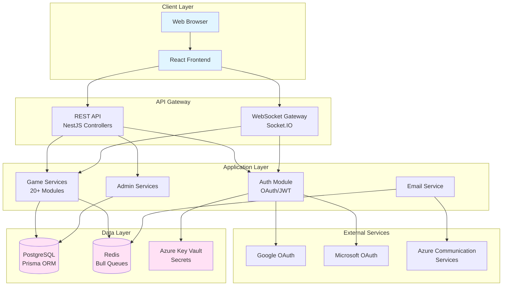

---

## 2. Monorepo Package Structure

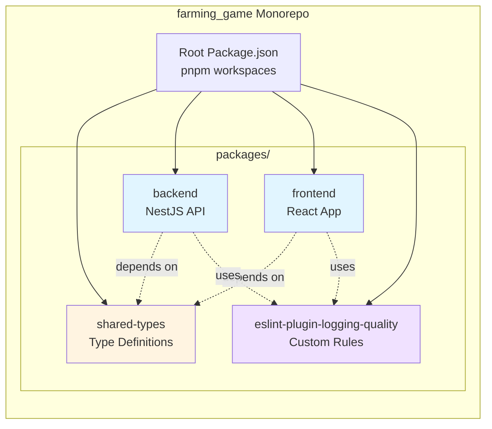

---

## 3. Backend Service Module Architecture

```mermaid
graph TB
    subgraph "NestJS App Module"
        App[AppModule]
    end
    
    subgraph "Core Game Modules"
        GameMod[GameModule]
        GameLoopMod[GameLoopModule]
        CardMod[CardEffectModule]
        TileMod[TileEffectModule]
        HarvestMod[HarvestModule]
        BoardMod[BoardModule]
        AssetMod[AssetModule]
        PlayerMod[PlayerModule]
        AIMod[AIModule]
    end
    
    subgraph "Infrastructure Modules"
        AuthMod[AuthModule]
        PrismaMod[PrismaModule]
        LoggerMod[LoggerModule]
        EmailMod[EmailModule]
        HealthMod[HealthModule]
    end
    
    subgraph "Gateway Modules"
        GatewayMod[GatewayV2Module]
    end
    
    subgraph "Specialized Modules"
        MarketMod[MarketplaceModule]
        BankMod[BankruptcyModule]
        BankAucMod[BankruptcyAuctionModule]
        NetWorthMod[NetWorthModule]
        SettingsMod[SettingsModule]
    end
    
    App --> GameMod
    App --> GameLoopMod
    App --> CardMod
    App --> TileMod
    App --> HarvestMod
    App --> BoardMod
    App --> AssetMod
    App --> PlayerMod
    App --> AIMod
    App --> AuthMod
    App --> PrismaMod
    App --> LoggerMod
    App --> EmailMod
    App --> HealthMod
    App --> GatewayMod
    App --> MarketMod
    App --> BankMod
    App --> BankAucMod
    App --> NetWorthMod
    App --> SettingsMod
    
    GatewayMod --> GameMod
    GatewayMod --> PlayerMod
    GatewayMod --> MarketMod
    GatewayMod --> BankAucMod
    
    style App fill:#ff6b6b
    style GameMod fill:#4ecdc4
    style GatewayMod fill:#95e1d3
    style AuthMod fill:#ffe66d
```

---

## 4. WebSocket Gateway V2 Architecture

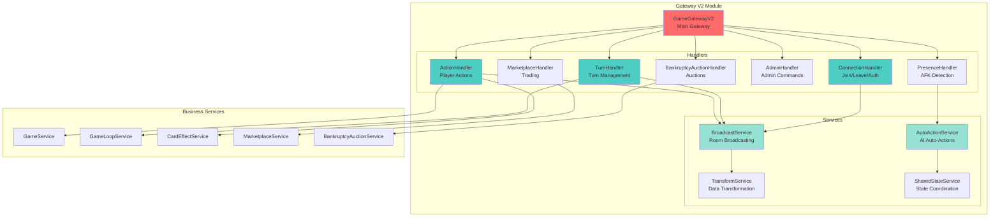

---

## 5. Request/Response Flow: Player Action

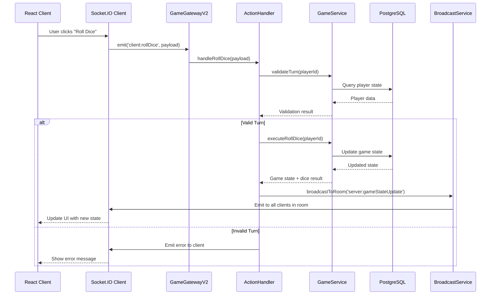

---

## 6. Authentication Flow

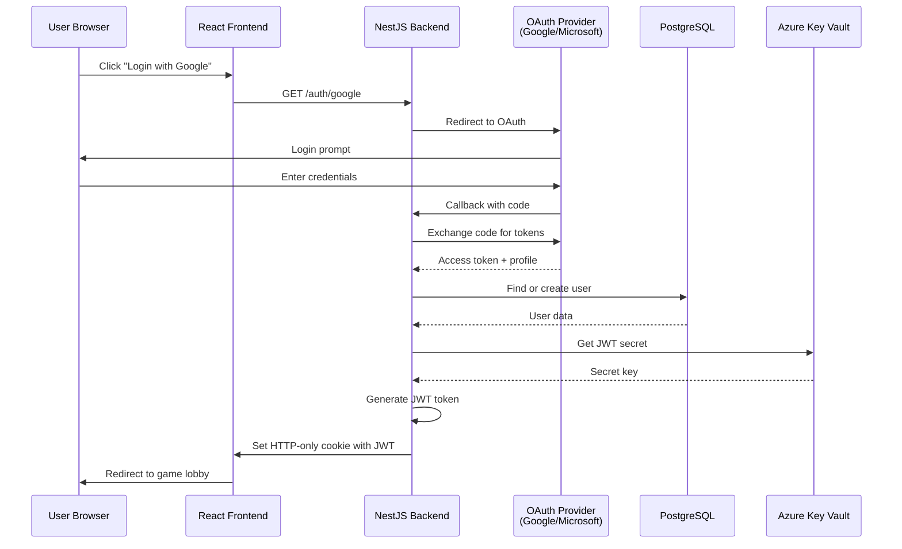

---

## 7. Database Schema Relationships

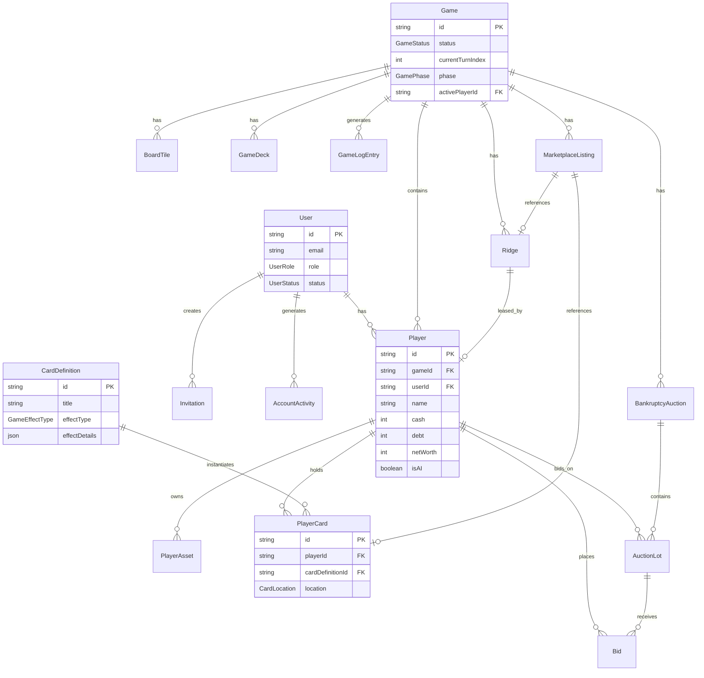

---

## 8. Frontend State Management Flow

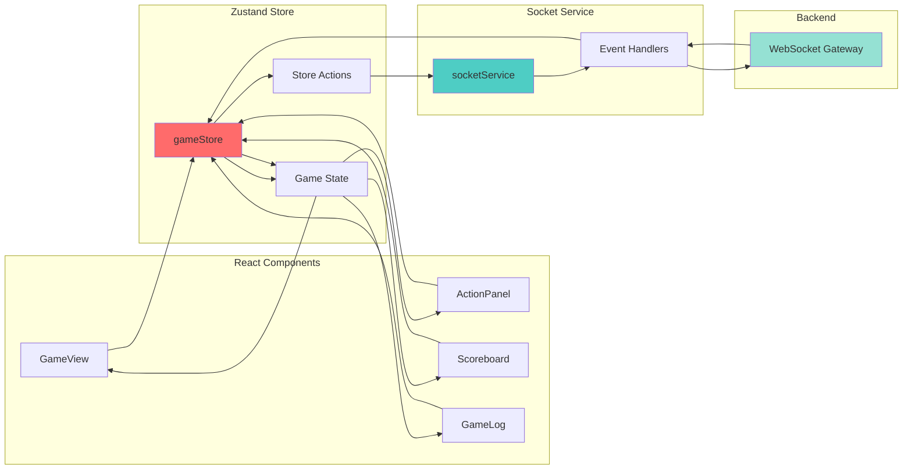

---

## 9. Build & Deployment Pipeline

```mermaid
graph LR
    subgraph "Development"
        Dev[Local Development<br/>pnpm run dev]
    end
    
    subgraph "Build Process"
        Build1[Build shared-types<br/>pnpm --filter shared-types build]
        Build2[Build backend<br/>pnpm --filter backend build]
        Build3[Build frontend<br/>pnpm --filter frontend build]
    end
    
    subgraph "Testing"
        Test[Run Tests<br/>pnpm test]
        TypeCheck[Type Check<br/>pnpm typecheck]
    end
    
    subgraph "CI/CD"
        GitHub[GitHub Actions]
        Docker[Docker Build]
        Azure[Azure App Service]
    end
    
    Dev --> Build1
    Build1 --> Build2
    Build2 --> Build3
    Build3 --> Test
    Test --> TypeCheck
    TypeCheck --> GitHub
    GitHub --> Docker
    Docker --> Azure
    
    style Build1 fill:#fff4e1
    style Build2 fill:#e1f5ff
    style Build3 fill:#e1f5ff
    style GitHub fill:#95e1d3
    style Azure fill:#ff6b6b
```

---

## 10. Logging & Monitoring Architecture

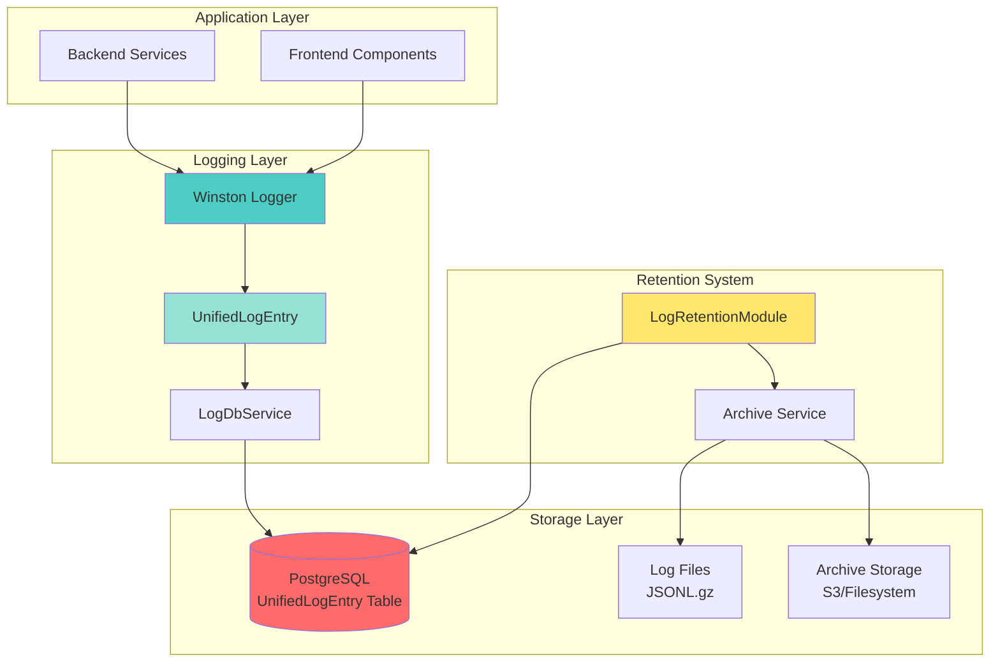

---

## 11. Marketplace & Bankruptcy Auction Flow

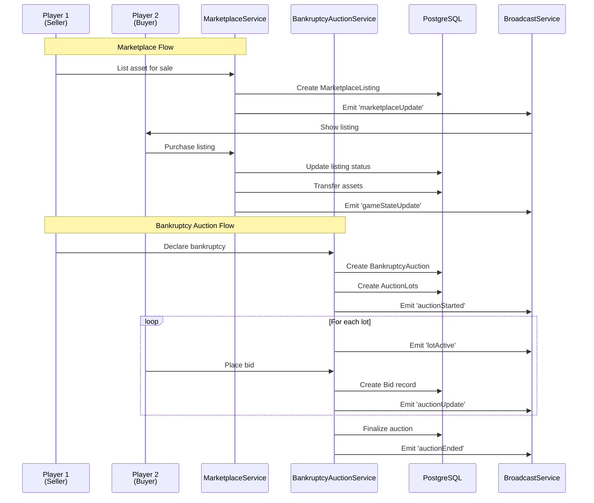

---

## 12. Email Queue Processing Flow

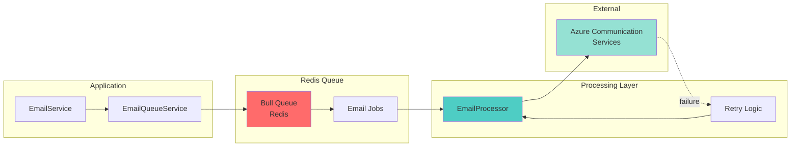

---

## Summary

These diagrams illustrate:

1. **System Architecture:** High-level overview of all components and their relationships
2. **Package Structure:** Monorepo organization and dependencies
3. **Service Modules:** Backend modular architecture with 20+ specialized modules
4. **WebSocket Gateway:** Real-time communication architecture with specialized handlers
5. **Request Flow:** Sequence of operations for player actions
6. **Authentication:** OAuth flow with JWT cookie management
7. **Database Schema:** Entity relationships and data model
8. **Frontend State:** Zustand store and component interactions
9. **Build Pipeline:** Development to production deployment process
10. **Logging System:** Comprehensive logging architecture with retention
11. **Marketplace/Auction:** Trading and bankruptcy auction flows
12. **Email Processing:** Queue-based email delivery system

These visual representations complement the textual documentation and provide a comprehensive understanding of the Farming Game architecture.

